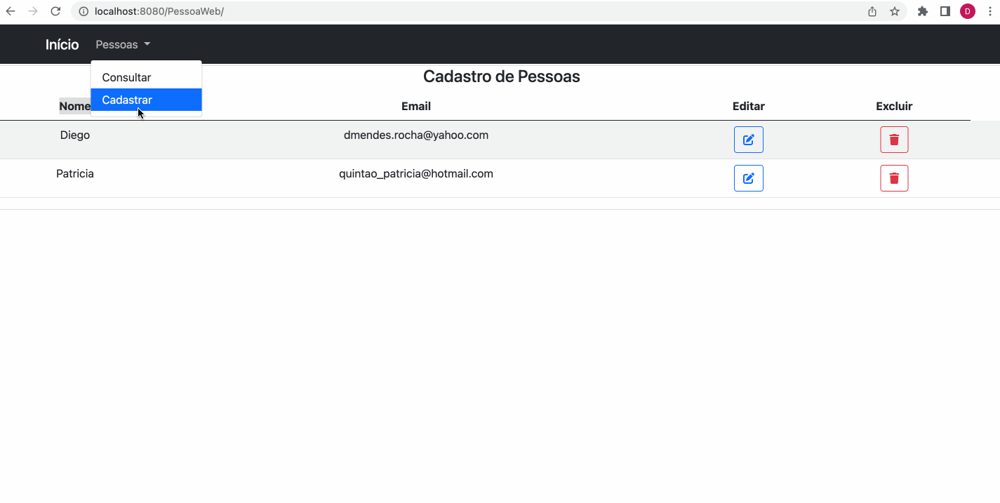

<h1>Pessoa Web Cadastros</h1>

Essa aplicação consiste em um sistema de cadastros de Pessoas.

Faz parte do curso Java Web do <a href="https://startcapgemini.com.br/">programa Start Capgemini</a>.

Criei um banco de dados PostgreSQL, os métodos GET, PUT, POST, DELETE usando Java e como linguagem de script, JSP, para gerar um conteúdo dinâmico. Foi usado também o Bootstrap para auxílio na estilização das páginas.

<h3>Amostra:</h3>

<h3>Como rodar este site?</h3>

 1) Clone o repositório 

     $ git clone https://github.com/dieegomr/PessoaWeb.git

 2) Abre a pasta do projeto usando uma IDE como NetBeans por exemplo.

 3) Crie um banco de dados no PostgresSQL contendo as colunas: idpessoa (Primary Key), nomepessoa e email

 4) Na classe Conexao, dentro do package util, atribuir valores as variáveis USER, PASS e URL, de acordo com as informações do seu banco

 3) Click na opção rodar o projeto

 4) Copie o link do localhost indicado pela IDE e cole no seu browser

